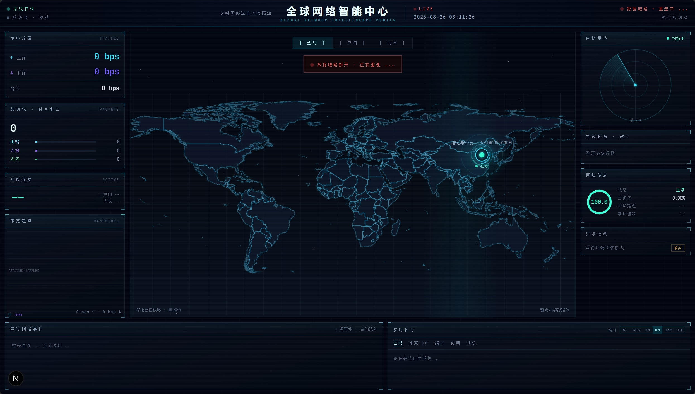

# NetScope · GLOBAL NETWORK INTELLIGENCE CENTER

<p align="center">
  
</p>

<p align="center">
  <b>实时全球网络智能监控中心 · Real-Time Network Traffic Visualization</b>
</p>

<p align="center">
  
  
  
  
  
  
  
</p>

---

## 简介

NetScope 是一个**全球网络智能监控中心**——基于真实路由器数据的实时网络流量可视化系统。

它回答一个核心问题：

> **我的服务器，此刻正在和世界上的哪些地方通信？**

系统从 iKuai 路由器持续采集真实的终端、连接与流量数据，经过方向判定、字段归一、NAT 解析与 GeoIP 地理解析后，通过 WebSocket 实时推送到前端，最终以 Dark Cyber / 未来 HUD 风格呈现在一张可交互的世界地图上：

```text
服务器 ──▶ iKuai Router ──▶ Django Backend ──▶ WebSocket ──▶ Next.js ──▶ 你眼前的全球网络图谱
```

每一个光点、每一条流光、每一次雷达扫描背后，都是一条**真实发生**的网络连接。

## ✨ 特性

### 数据层（真实、不伪造）

- **真实数据源**：所有流量、IP、国家、地理信息均来自 iKuai 路由器，禁止随机伪造
- **方向权威判定**：`outbound / inbound / internal` 由后端统一判定（D1–D5 规则 + `LISTEN_PORTS` 入站识别），前端不做二次猜测
- **NAT 解析**：还原 NAT 前后的真实通信两端
- **GeoIP 服务**：MaxMind GeoLite2 + 多级降级源 + 手工覆盖，公网 IP 补充经纬度 / 国家 / 城市；私网 IP 永不进入公网地理查询
- **Mock 同构**：`DATA_SOURCE=mock` 模拟数据走与真实数据**完全相同**的归一管线，一套 UI，两种数据源

### 实时层（Redis 驱动）

- **批量广播**：WebSocket 按 400ms 批量推送，杜绝逐条刷屏
- **增量补齐**：断线重连后通过 `GET /api/packets?since={seq}` 拉取缺失事件
- **滚动窗口聚合**：6 档时间窗口（5s–3600s）实时统计
- **EWMA 带宽估算**：基于连接速率差分平滑估算实时带宽
- **环形事件缓冲**：有限缓存、超限淘汰，事件流永不撑爆内存

### 可视化层（不是普通 Dashboard）

- **三大地图场景**：`GLOBAL`（公网 ↔ 服务器）/ `CHINA`（国内视图）/ `LAN`（内网设备环形拓扑）
- **Dark Cyber HUD 风格**：深空背景、发光边界、微弱网格、扫描线、雷达、粒子与流光——克制而不堆砌
- **启动动画**：INITIALIZING NETWORK CORE → SYSTEM ONLINE 的开屏序列
- **多维度排名**：国家 / 协议 / 应用 / 端口 / IP / 流量 实时排行榜
- **实时事件流**：REAL-TIME EVENT STREAM 滚动展示每一条连接事件
- **连接详情**：点开任意节点，查看设备、IP、端口、协议、方向、上传 / 下载流量全链路

## 🏗 架构

```text
┌─────────────────────────────────────────────────────────────────┐
│                            iKuai Router                          │
│        /Action/login · 终端列表 · 连接详询 · 系统指标 · WAN          │
└──────────────────────────┬──────────────────────────────────────┘
                           │ HTTP (sess_key Cookie)
                           ▼
┌─────────────────────────────────────────────────────────────────┐
│                    Collector（独立采集进程）                        │
│   SessionManager ─▶ iKuai SDK ─▶ PollScheduler(asyncio)          │
│                            │                                     │
│              Adapter：方向判定 D1–D5 / 字段清洗 / NAT 解析          │
│              GeoService：MaxMind + 降级源 + Redis 缓存             │
│                            │                                     │
│         ┌────────────────┼─────────────────┐                    │
│         ▼                ▼                 ▼                      │
│   Redis 实时层      Aggregator(滚动窗口)    EventBus              │
│   (net:*)           + EWMA 带宽            (批量广播 400ms)         │
└────────┬───────────────────────┬────────────────────────────────┘
         ▼                       ▼
   DRF REST /api/*        Channels /ws/network/
         └───────────┬───────────────┘
                     ▼
              Next.js 前端（地图 + HUD + 面板）

冷路径：Aggregator ──每分钟──▶ PostgreSQL（快照 / 审计 / 事件）
```

## 📦 仓库结构

```text
NetScope/
├── AGENTS.md            # 项目完整设计规范（上游需求文档）
├── doc/
│   ├── backend-design.md   # 后端详细设计文档
│   └── img/                # 文档图片
├── sdk/                 # iKuai SDK：纯标准库封装路由器登录与数据接口
│   └── ikuai_sdk/
├── backend/             # Django 后端
│   ├── config/          #   settings(dev/prod) + asgi / urls / routing
│   ├── core/            #   redis_store / event_bus / geo / lan_layout
│   ├── datasource/      #   ikuai(session/gateway/scheduler) + mock
│   ├── network/         #   adapters / services / consumers / views
│   ├── analytics/       #   滚动窗口聚合 + EWMA 带宽 + 快照模型
│   └── tests/           #   方向黄金用例 / 契约 / 容错 / WS 集成
└── frontend/            # Next.js 前端
    └── src/
        ├── app/         #   页面入口
        ├── components/  #   map / hud / panels / charts / events
        ├── hooks/       #   useNetworkStream / useWindowedFlows
        ├── lib/         #   api client / adapter / 网络工具
        └── store/       #   zustand 状态管理
```

各子模块详细说明：

- 📖 [backend/README.md](backend/README.md) — 后端快速开始、API 一览、配置项
- 📖 [doc/backend-design.md](doc/backend-design.md) — 后端架构设计文档（20 章全量）
- 📖 [sdk/README.md](sdk/README.md) — iKuai SDK 使用手册

## 🚀 快速开始

### 环境要求

- Python 3.12+
- Node.js 18+（建议 20+）
- Redis 7.x
- PostgreSQL 15+（开发期可用 SQLite）
- 一台 iKuai 路由器（没有？用 `mock` 模式同样体验完整管线）

### 1. 启动后端

```bash
cd backend

# 创建虚拟环境并安装依赖
python3 -m venv .venv
.venv/bin/pip install -r requirements.txt -r requirements-dev.txt

# 配置环境变量（填入 Redis / PostgreSQL / iKuai 凭据）
cp .env.example .env

# 数据库迁移
.venv/bin/python manage.py migrate

# 开发模式启动（RUN_COLLECTOR_IN_PROCESS=1 时采集线程随服务启动）
.venv/bin/python manage.py runserver 0.0.0.0:8000
```

生产环境建议双进程：

```bash
.venv/bin/python manage.py collect_network                      # 采集器
.venv/bin/daphne -b 0.0.0.0 -p 8000 config.asgi:application     # Web + WebSocket
```

### 2. 启动前端

```bash
cd frontend

npm install

# 开发模式（默认 http://localhost:3000）
npm run dev
```

### 3. 打开面板

浏览器访问 `http://localhost:3000`，经过约 1–2 秒的启动动画后，即可看到实时网络流量在全球地图上流动。

> 没有真实 iKuai 路由器？把 `backend/.env` 中 `DATA_SOURCE=mock` 打开，模拟数据将走完全相同的管线，用于开发与演示。

## 🔌 API 一览

| 接口 | 说明 |
|------|------|
| `GET /api/mode` | 数据源模式、网关定位、iKuai 健康状态 |
| `GET /api/packets?since={seq}` | 增量事件拉取（断线补齐通道） |
| `GET /api/stats?window={5..3600}` | 全局统计快照（6 档窗口） |
| `GET /api/devices` | 内网设备表（LAN 环形布局坐标） |
| `GET /api/nodes` | 公网热点节点（流量 Top64 + Geo 坐标） |
| `GET /api/network/{countries,protocols,applications,ports,ips}` | 多维度排名 |
| `GET /api/network/{connections,events,history}` | 连接表 / 系统事件 / 历史汇总 |
| `GET /api/health` | 健康检查（Redis + 采集器心跳） |
| `WS /ws/network/` | 实时通道：`hello / snapshot / packets / traffic / stats / status / alert / heartbeat` |
| `GET /api/schema/` | OpenAPI 3 文档（drf-spectacular） |

## ⚙️ 关键配置

完整配置说明见 [`doc/backend-design.md` §16](doc/backend-design.md) 与 `backend/.env.example`：

| 变量 | 说明 |
|------|------|
| `DATA_SOURCE` | `ikuai`（真实路由器）/ `mock`（同管线模拟） |
| `REDIS_URL` | Redis 连接（Channel Layer + 实时热数据 + Geo 缓存） |
| `IKUAI_ROUTER_URL` | iKuai 面板地址 |
| `IKUAI_USERNAME` / `IKUAI_PASSWORD` | iKuai 登录凭据 |
| `LISTEN_PORTS` | 入站判定依据：本地端口命中即 inbound（D3 规则） |
| `GEO_MAXMIND_CITY_DB` | GeoLite2-City.mmdb 路径 |
| `SERVER_LOCATION` | 核心服务器定位：域名或 IP（留空自动用 WAN 出口定位） |
| `RUN_COLLECTOR_IN_PROCESS` | `1` = 采集线程随 Django 启动（仅开发） |

## 🧪 测试

```bash
cd backend
.venv/bin/python -m pytest tests/ -q
```

测试覆盖：方向判定黄金用例（D1–D5）、脏数据模糊测试、连接生命周期与速率差分、聚合窗口、Geo 缓存链路、前后端 API 契约逐字段对齐、WebSocket 消费者。

前端类型检查：

```bash
cd frontend
npm run typecheck
```

## 🛠 技术栈

| 层 | 技术 |
|----|------|
| 后端 | Python 3.12 · Django 5 · DRF · Channels · Daphne |
| 实时层 | Redis 7（Channel Layer + 热数据 + Geo 缓存） |
| 数据库 | PostgreSQL（生产）/ SQLite（开发） |
| 数据源 | iKuai SDK（纯 Python 标准库） |
| 前端 | Next.js 15 · React 19 · TypeScript · Tailwind CSS 4 · Zustand |
| 可视化 | 自绘 Canvas 渲染引擎（零图表库依赖）· 世界 / 中国 GeoJSON 地图 |
| API 文档 | drf-spectacular（OpenAPI 3） |

## 📄 许可证

私有项目，版权归属见仓库远程配置。
